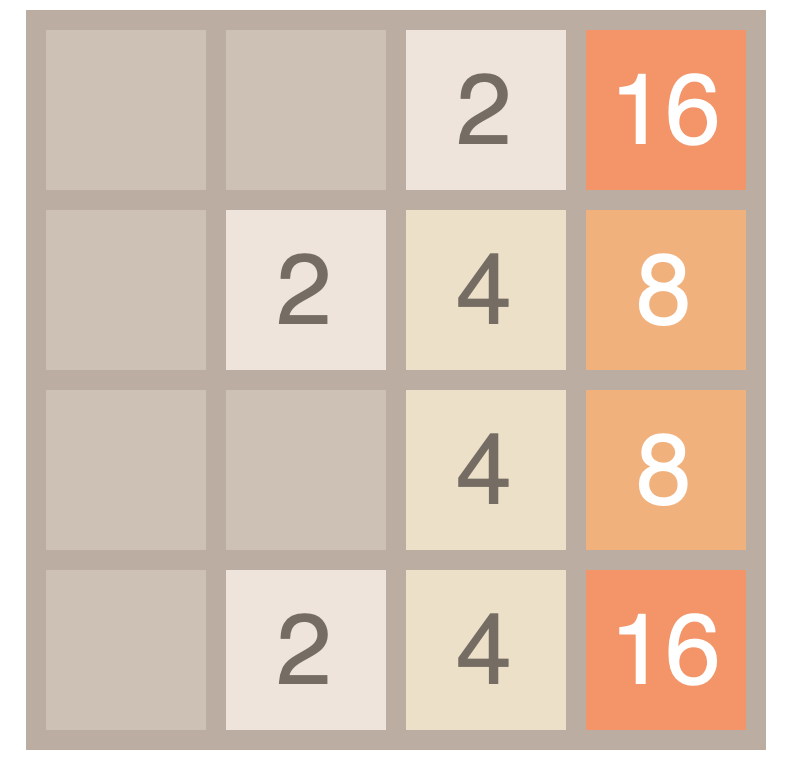

# 2048
This project is my interpretation of a 2048 game, which can be played by user or AI using genetic algorithm. It was written in JavaScript. 

## Getting started

In this project, I focused on implementation of genetic algorithm for 2048 game. AI is supposed to learn to maximazie the score. All needed functions and classes that represent game lpayed by user, game played by AI, board as so on are provided in js file.  

### Genetic algorithm 

Every generation consists of some populations, that are represented by brains, which are neural nets that process information about board and generate an action. An input to the net is a 4 x 4 matrix of the values in cells of the board, mapped into a vector. Net has two hidden layers, which contain 24 neurons (all those parameters can be easily changed). An output is one of the particular actions that can be made: go left, right, up, down. 

 

Every generation of snakes evolves. 25% of the population, that acted the best, is crossovered and mutated with each other and with newly generated brains.

So far, the results haven't been so satisfying, even after quite big number of generations. The maximum result achieved by the game, which I noticed, was 256. But the AI seems to understand slowly how to make better result. So obviously, this project will still be developed.